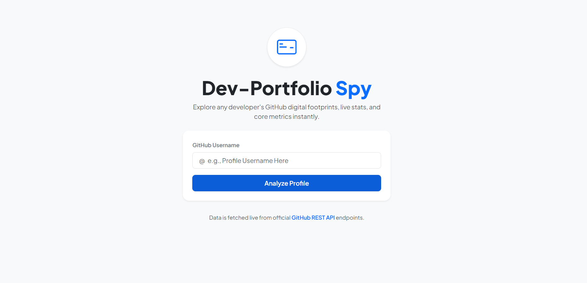

# 🔍 Dev-Portfolio Spy

A sleek, modern, and highly responsive **ASP.NET Core 8.0 MVC** web application that connects with the official **GitHub REST API** to fetch live developer footprints, repository metrics, and profile analytics instantly.

---

## 📸 Project Screenshots

Here is a visual sneak peek of the application in action:

### 1. Main Search Dashboard
*Explore any developer by entering their GitHub username in a clean, centered interface.*

### 2. Live Developer Profile Card
*Beautifully structured developer card showing live repositories, followers, following count, and metadata.*

---

## 🚀 Features

* **Live Data Fetching**: Seamlessly communicates with the official GitHub API endpoints.
* **Strongly Typed Models**: Implements clean JSON deserialization matching C# models natively.
* **Clean UI/UX**: Designed using Bootstrap 5, smooth focus effects, and premium *Plus Jakarta Sans* typography.
* **Robust Error Handling**: Built-in validation alerts for missing or invalid GitHub usernames.

---

## 🛠️ Tech Stack & Architecture

* **Backend**: .NET 8.0 (C#) / ASP.NET Core MVC
* **API Integration**: Native `HttpClient` with Dependency Injection (`AddScoped`)
* **JSON Handler**: `System.Text.Json` (with Case-Insensitive deserialization options)
* **Frontend**: HTML5, CSS3, Bootstrap 5 (via CDN), Google Fonts

---

