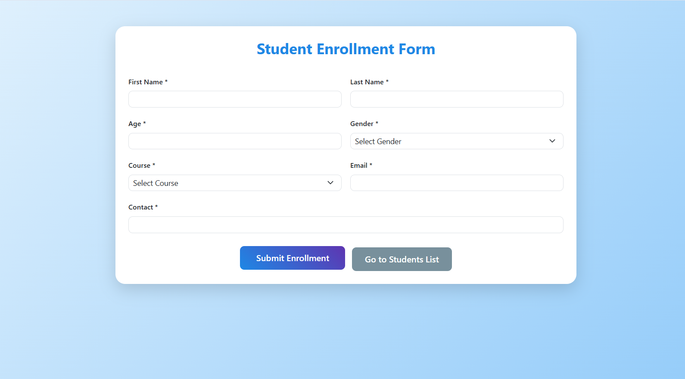
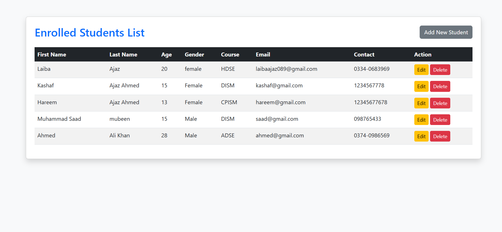
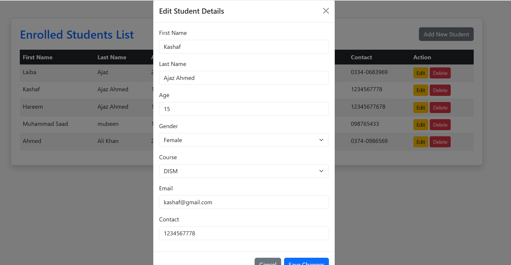
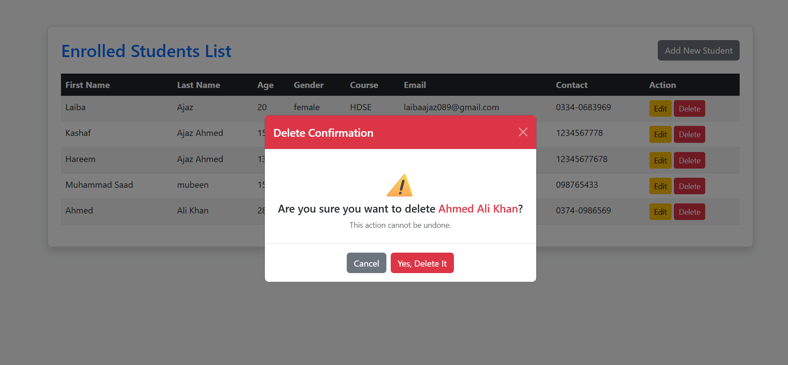

# Student Enrollment Form (CRUD Application)

A modern, clean, and fully functional Student Enrollment Management System built using **ASP.NET Core MVC** and **Entity Framework Core**. This project demonstrates complete CRUD (Create, Read, Update, Delete) operations with a single-page list management using **Bootstrap Modals** and **jQuery**.

---

## 🚀 Features

* **Responsive Enrollment Form:** A beautiful, gradient-styled form to register students with dynamic validations.
* **Single-Page CRUD Management:** View, Edit, and Delete students without navigating away from the list page.
* **Bootstrap Modals Integration:** Interactive popup modals for Updating student records and confirming Deletions.
* **jQuery Data Binding:** Seamlessly extracts data from table rows and binds it to modal input fields instantly.
* **Database Persistence:** Powered by SQL Server using Entity Framework Core (Code-First Approach).

---

## 📸 Screenshots

### 1. Student Enrollment Form (Index Page)
*The entry point where new students are registered with a modern gradient UI.*

### 2. Enrolled Students List (View Page)
*Displays all records in a structured table with quick actions.*

### 3. Edit Student Details (Bootstrap Modal)
*Allows updating student profiles on the fly without refreshing the page.*

### 4. Delete Confirmation Modal
*A safety popup ensuring accidental clicks don't wipe out database records.*

---

## 🛠️ Tech Stack & Libraries

* **Backend:** .NET 8.0 / C# / ASP.NET Core MVC
* **Database ORM:** Entity Framework Core (SQL Server)
* **Frontend:** HTML5, CSS3 (Custom Gradients), Razor Views
* **UI Framework:** Bootstrap 5.3
* **Scripting:** jQuery 3.6.0 (DOM Manipulation)

---

